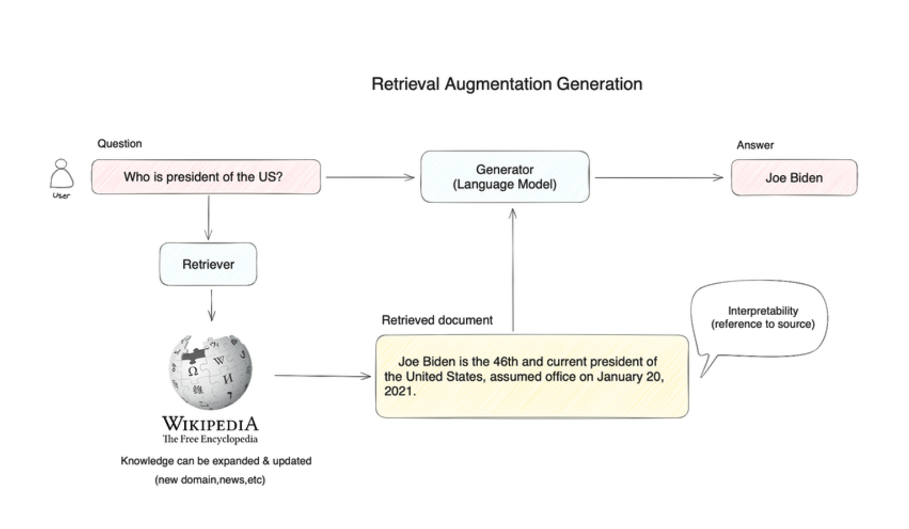

In the rapidly evolving field of artificial intelligence, two prominent technologies often come up in discussions: AI agents and Retrieval Augmented Generators (RAGs). While both serve to enhance and automate processes, they operate on fundamentally different principles and are suited for distinct use cases.

## AI Agents

AI agents are autonomous programs designed to perform specific tasks or make decisions based on predefined rules or learned behaviors. They can interact with their environment and adapt their actions based on the feedback they receive.

### Key Features:

- **Autonomy**: Operate without human intervention.
- **Adaptability**: Learn from interactions and improve over time.
- **Task-Specific**: Typically designed for specific functions like customer service, data analysis, or automated trading.

### Examples:

- **Chatbots**: Provide customer support by responding to user inquiries.
- **Virtual Assistants**: Assist with scheduling, reminders, and information retrieval.
- **Automated Trading Systems**: Execute trades based on market data and algorithms.

## Retrieval Augmented Generators (RAGs)

RAGs combine the power of generative models with retrieval mechanisms to enhance the quality and relevance of the generated content. They first retrieve relevant documents or information from a large dataset and then use this retrieved context to generate more accurate and contextually appropriate responses or content.

### Key Features:

- **Contextual Retrieval**: Fetch relevant data from a corpus before generating responses.
- **Enhanced Accuracy**: Leverage external information to produce more informed outputs.
- **Scalability**: Handle large datasets and generate responses quickly.

### Examples:

- **Question Answering Systems**: Retrieve relevant documents to answer user queries more accurately.
- **Content Generation**: Create articles or reports by pulling in contextually relevant information from vast datasets.
- **Code Assistance**: Fetch relevant code snippets or documentation to assist developers.

## Comparison

| Feature           | AI Agents                           | Retrieval Augmented Generators (RAGs)   |
| ----------------- | ----------------------------------- | --------------------------------------- |
| **Functionality** | Task-specific actions and decisions | Contextual content generation           |
| **Interaction**   | Direct interaction with environment | Indirect via retrieval and generation   |
| **Adaptability**  | Learns from interactions            | Enhances generation with external data  |
| **Use Cases**     | Customer service, automation        | Information retrieval, content creation |

## Conclusion

AI agents and RAGs both offer powerful capabilities in the AI landscape, but they serve different purposes. AI agents excel in autonomous decision-making and task execution, while RAGs shine in generating accurate and contextually relevant content by leveraging large datasets. Understanding their differences and applications can help in selecting the right technology for your specific needs.

